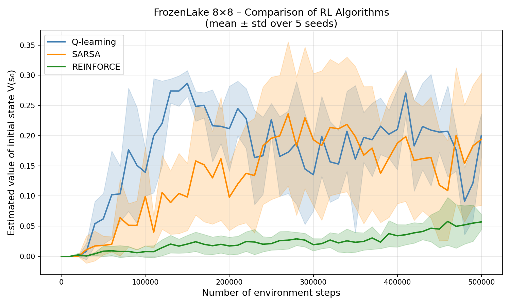

# Reinforcement Learning Algorithm Comparison: FrozenLake 8x8
This repository contains a Python implementation which benchmarks and compares three fundamental Reinforcement Learning (RL) algorithms on the Gymnasium `FrozenLake-v1` environment. 

The script trains **Q-learning**, **SARSA**, and **REINFORCE** agents on the 8x8 slippery variant of FrozenLake. To ensure statistical reliability, the models are trained across 5 independent random seeds. The script periodically evaluates the agents and produces a comparison plot showing the estimated value of the initial state $V(s_0)$ over 500,000 environment steps.

## Results Summary

Based on the generated plot (`rl_comparison.png`), the algorithms perform as follows in this sparse-reward, stochastic environment:
* **Q-learning (Off-policy TD):** Learns the most efficiently, showing the steepest learning curve and reaching the highest initial state value.
* **SARSA (On-policy TD):** Learns at a moderate pace, exhibiting slightly higher variance and a lower overall performance plateau compared to Q-learning. 
* **REINFORCE (Monte Carlo Policy Gradient):** Struggles to optimize effectively within the 500,000 step limit, remaining near zero. This highlights the difficulty of vanilla policy gradient methods in sparse-reward, highly stochastic gridworld environments without baseline subtractions or value function approximations.

## Requirements

To run this code, you will need Python 3.7+ and the following libraries:
```bash
pip install numpy matplotlib gymnasium
```

## Usage

Before running the script, ensure you have a directory named `Results` in the same folder as your script, as the program will attempt to save its outputs there.

1. Create the output directory:
   ```bash
   mkdir Results
   ```
2. Run the main Python script:
   ```bash
   python main.py
   ```
   *(Note: Replace `main.py` with the actual filename of your script).*

## Outputs

Upon completion, the script generates two files in the `Results/` directory:

1.  **`rl_comparison.png`**: A matplotlib line chart displaying the training curves (mean ± standard deviation) for all three algorithms.
2.  **`rl_results.npz`**: A compressed NumPy array file containing the raw evaluation steps and values for all seeds. You can load this file later to perform custom statistical analyses or recreate the plots without retraining the models.

## Algorithms & Hyperparameters

The following hyperparameter settings are consistent across all runs:
* **Environment:** `FrozenLake-v1`, `map_name="8x8"`, `is_slippery=True`
* **Discount Factor $\gamma$:** 0.99
* **Max Steps per Episode:** 200
* **Total Training Steps:** 500,000
* **Evaluation:** Every 10,000 steps, averaged over 500 episodes

### 1. Q-learning
* **Type:** Value-based, Off-policy
* **Learning Rate $\alpha$:** 0.1
* **Exploration:** $\epsilon$-greedy (decaying linearly from 1.0 to 0.05 over 300,000 steps)

### 2. SARSA
* **Type:** Value-based, On-policy
* **Learning Rate $\alpha$:** 0.1
* **Exploration:** $\epsilon$-greedy (decaying linearly from 1.0 to 0.05 over 300,000 steps)

### 3. REINFORCE
* **Type:** Policy Gradient, On-policy
* **Policy:** Tabular stochastic policy using softmax
* **Learning Rate:** 0.005
* **Clipping:** Parameter updates are clipped between -20.0 and 20.0 for numerical stability.
